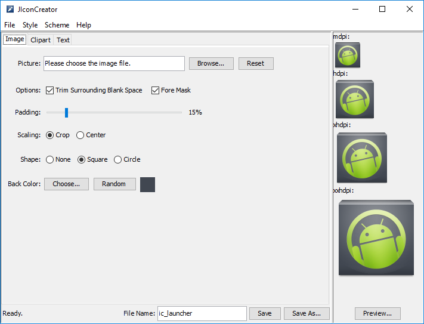

JIconCreator
============

JIconCreator is an improved icon-making program that was used in the Android ADT plugin for Eclipse. I have added some options regarding the random selection of colors and disabling the overlay mask.



The icon generator was rewritten from the scratch. Therefore, dependencies of various big Java-libraries, including: SWT, Guava and Android SDK, have been removed from the application. The standard Swing/AWT libraries from the JDK were used for creating GUI. The JIconCreator application has been tested on JRE 8.

## Download

You can download JAR-package for Java platform from the [releases](https://github.com/EXL/JIconCreator/releases) section.

## Build instructions

For example, MS Windows:

* Install the latest [JDK](http://www.oracle.com/technetwork/java/javase/downloads/index.html), tested with JDK 8;

* Clone repository into deploy directory;

```bat
cd C:\Dev\Deploy\
git clone https://github.com/EXL/JIconCreator JIconCreator
```

* Build the fat (with all dependencies) JAR-package into deploy catalog with Gradle Build Tool;

```bat
cd C:\Dev\Deploy\JIconCreator\
gradlew.bat build
```

* Get cooked JAR-package from the `build\libs\` directory.

You can also open this project in IntelliJ IDEA IDE and build the JAR-package by using this program.

## More information

Please read [Creating Guide (in Russian)](https://exlmoto.ru/new-updates-and-tools-2/#jiconcreator) for more information about creating JIconCreator application for Java platform.
